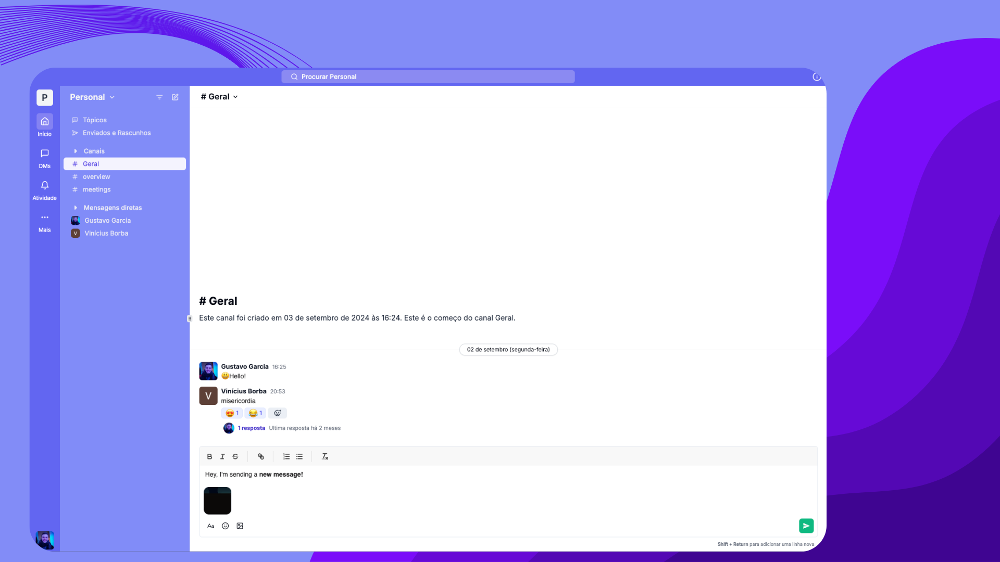

# Nuvio - Full Stack

Nuvio is a modern, feature-rich communication and collaboration platform inspired by Slack. It offers real-time messaging, channels, file sharing, and integrations designed to support team productivity and streamline workflows. Built with scalability, responsiveness, and user experience in mind, Nuvio serves as an ideal solution for companies looking to foster collaborative work environments.

## ✨ Live Preview

You can access the live preview clicking [here]().

## Preview

## 🚀 Technologies

- Next.JS
- React.JS
- Convex
- Jotai
- Nuqs
- Quill
- TailwindCSS
- TypeScript

## 💻 Copywright

Feel free to use this material to your own projects.
